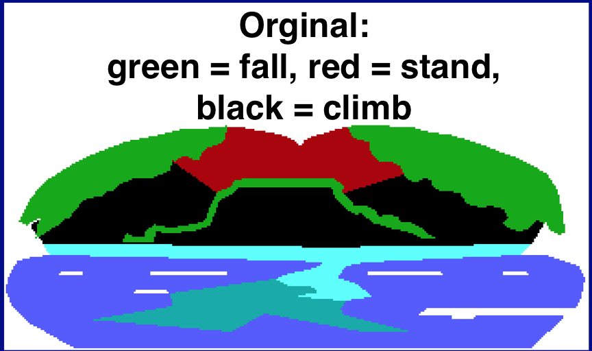
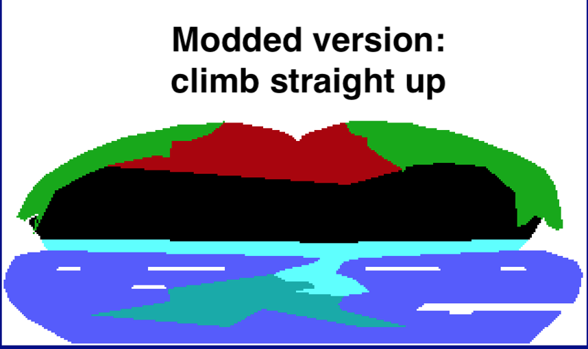
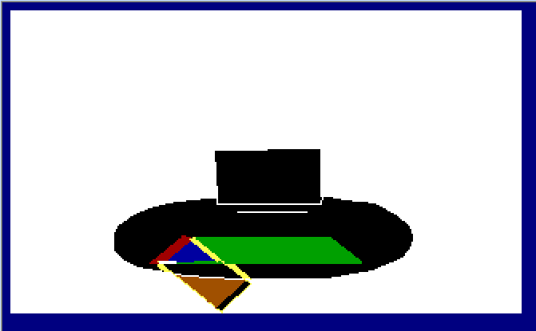
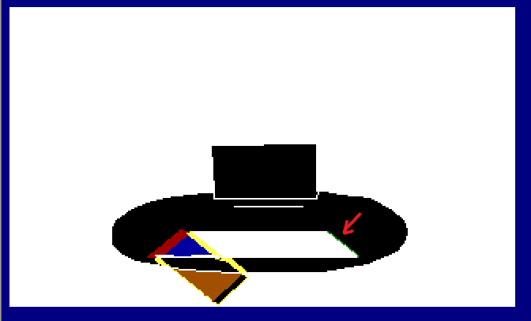

# KQIV Whale Tongue Accessibility Patch
 
Verion 1.0.1

This replaces the control pic of the whale's belly making it trivial to climb. It also fixes a bug in the original game that would otherwise cause a lock up when falling off the top of the tongue.

Developed using <a href="http://scicompanion.com/">SCI Companion</a>

Installation:

Copy pic.044 and script.044 into your KQIV game folder and start the game normally. Uninstall by removing the files.

I'm expanding to eventually prevent falling deaths in all situations making the keyboard a vialable option for all players. You can use as many or as few of these as desired. I've indicated which file names match to the rooms. Ignore any .png files.

Haunted House

Organ - file: pic.058

Note: I added a sliver of ctlGREEN on the back edge (red arrow). Don't forget to save and fall from the top! (make sure you're using the EGA320.DRV in dosbox or you will not get ShakeScreen at the bottom)

Organ stairs - file: pic.061

https://github.com/Doomlazer/KQIV-Whale-Tongue-Accessability-Patch
