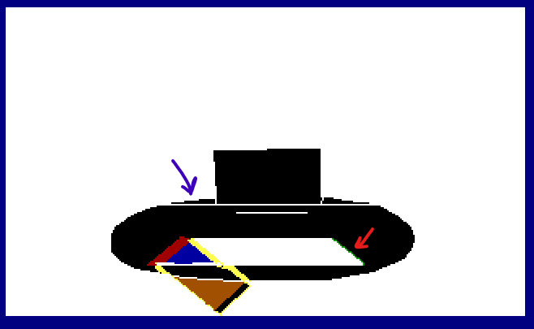
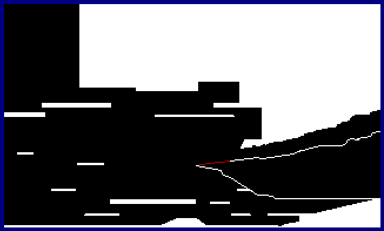
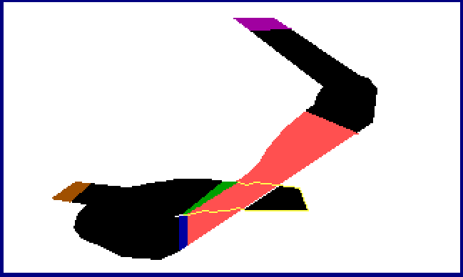

# KQIV Whale Tongue Accessibility Patch
 
Verion 2.0

This replaces the control pic of the whale's belly making it trivial to climb. It also fixes a bug in the original game that would otherwise cause a lock up when falling off the top of the tongue.

V2.0 expands things to remove death by sudden stop in almost every location of the game with one intentional exception. With

Developed using <a href="http://scicompanion.com/">SCI Companion</a>

Installation:

The patch files can be added and removed from the KQ4 game folder as needed. They are all in the format pic.xxx and are identified below.

Whale belly - you must copy both pic.044 and script.044 for this location otherwise the game locks up after falling off the tongue. 

Haunted House

Organ - file: pic.058

Note: I added a sliver of ctlGREEN on the back edge (red arrow). Don't forget to save and fall from the top! (make sure you're using the EGA320.DRV in dosbox or you will not get ShakeScreen at the bottom). The purple arrow indicates I've made the organ flush with the back wall. This makes it easy to slide in and out of the organ.

Organ stairs - file: pic.061

Organ bottom - file: pic.066

OCEAN

Ocean cliff - pic.019

Lolotte's castle

Mountain entrance - pic.030

Mountain path - pic.079 and pic.179 (night)

Mountain entrance - pic.030

Stable - pic.080

Stairwell 85 - pic.085

Stairwell 88 - pic.088

Stairwell 90 - pic.090

Stairwell 93 - pic.093

https://github.com/Doomlazer/KQIV-Whale-Tongue-Accessability-Patch
